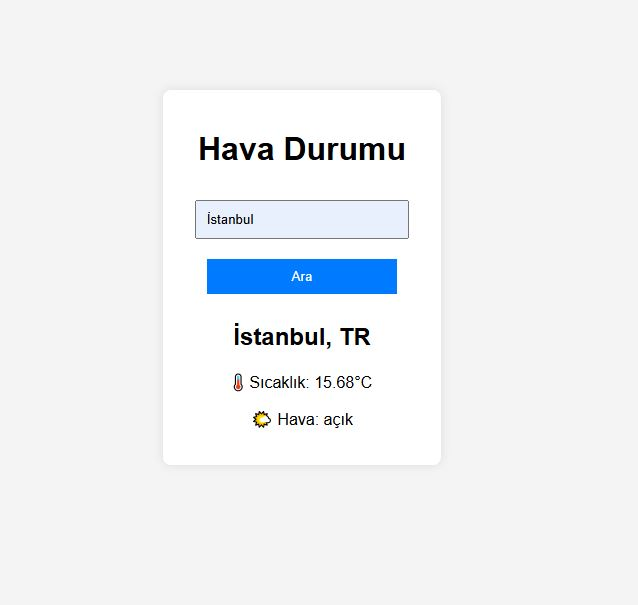

# Hava Durumu Uygulaması 🌦️

Bu proje, **JavaScript + OpenWeatherMap API** kullanarak geliştirilmiş bir hava durumu uygulamasıdır. Kullanıcılar şehir isimlerini girerek anlık hava durumunu görebilir.

## 🚀 Özellikler
✅ **Anlık hava durumu verisi**  
✅ **Şehir bazlı arama**  
✅ **Enter tuşu ile arama yapabilme**  
✅ **Temiz ve modüler kod yapısı**  

## 📌 Kullanılan Teknolojiler
- JavaScript (ES6+)
- OpenWeatherMap API
- HTML & CSS
- Git & GitHub

## 🛠️ Kurulum ve Kullanım
**Projeyi klonla:**
git clone https://github.com/KULLANICI_ADIN/weather-app.git

1. VS Code ile aç.
2. index.html dosyasını çalıştır (Live Server önerilir).
3. Şehir ismi gir ve hava durumunu gör!

## 📷 Ekran Görüntüsü

🚀 Proje ile ilgili geliştirme önerileriniz varsa katkıda bulunun!
🌟 Eğer projeyi beğendiyseniz, GitHub’da ⭐ vererek destek olabilirsiniz!
